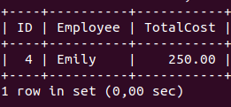
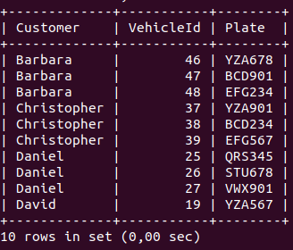
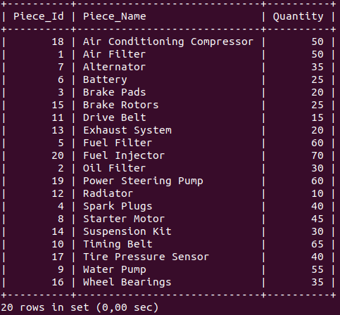
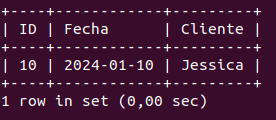
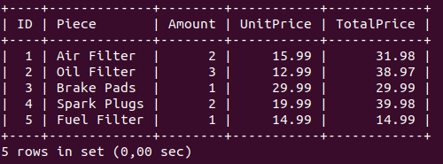

# MySQL_Project

## Consultas Requeridas
### 1. Obtener el historial de reparaciones de un vehículo específico

```sql

SELECT v.IdVehicle AS Cod_Vehicle, v.Plate 
AS Plate, r.Date AS Repair_Date,
e.Name1 AS Employee, s.ServiceName 
AS Service, r.TotalCost, r.
Description
FROM repair r
JOIN vehicle v ON v.IdVehicle = r.FkVehicle
JOIN employe e ON e.IdEmploye = r.FkEmploye
JOIN service s ON s.IdService = r.FkService
WHERE v.IdVehicle = 3;

```

#### Resultado


#### Explicacion

La consulta utiliza las tablas `repair`, 
`vehicle`, `employe` y `service`
para obtener el historial de reparaciones 
de un vehículo específico.
Se utiliza el `JOIN` para relacionar las 
tablas y obtener la información necesaria.
Se utiliza el `WHERE` para filtrar el 
resultado y obtener solo el historial de 
reparaciones del vehículo con el 
`IdVehicle` especificado (en este caso, 3).
El resultado incluye la fecha de 
reparación, el empleado que realizó la 
reparación,
el servicio realizado, el costo total y la 
descripción de la reparación.

### 2. Calcular el costo total de todas las reparaciones realizadas por un empleado específico en un período de tiempo

```sql

SELECT e.IdEmploye AS ID, e.Name1 AS
Employee, SUM(r.TotalCost) AS TotalCost
FROM repair r
JOIN employe e ON e.IdEmploye = r.FkEmploye
WHERE r.Date BETWEEN '2024-01-01' AND 
'2024-02-01'
AND e.IdEmploye = 4
GROUP BY e.Name1;

```

#### Resultado



#### Explicacion

La consulta utiliza las tablas `repair` y 
`employe` para calcular el costo total de
todas las reparaciones realizadas por un 
empleado específico en un período de 
tiempo.
Se utiliza el `JOIN` para relacionar las 
tablas y obtener la información necesaria.
Se utiliza el `WHERE` para filtrar el 
resultado y obtener solo las reparaciones 
realizadas por el empleado con el 
`IdEmploye` especificado (en este caso, 4).
Se utiliza el `BETWEEN` para filtrar el 
período de tiempo en el que se realizar
las reparaciones (en este caso, entre el 1 
de enero de 2024 y el 1 de febrero de 
2024). Se utiliza el `SUM` para calcular 
el costo  total de las reparaciones y el 
`GROUP BY` para agrupar el resultado por 
empleado.

### 3. Listar todos los clientes y los vehículos que poseen

```sql

SELECT c.Name1 AS Customer, v.IdVehicle AS VehicleId, v.Plate AS Plate
FROM client c
JOIN vehicle v ON c.IdClient = v.FkClient
ORDER BY c.Name1
LIMIT 10;

```

#### Resultado



#### Explicacion

La consulta utiliza las tablas `client` y 
`vehicle` para obtener la lista de 
clientes y los vehículos que poseen. Se 
utiliza el `JOIN` para relacionar las 
tablas y
obtener la información necesaria. Se 
utiliza el `ORDER BY` para ordenar el 
resultado por nombre de cliente y el 
`LIMIT` para obtener solo los 10 primeros 
resultados.

### 4. Obtener la cantidad de piezas en inventario para cada pieza

```sql

SELECT p.IdPiece AS Piece_Id, p.PieceName 
AS Piece_Name, SUM(i.Amount) AS Quantity
FROM piece p
JOIN inventory i ON p.IdPiece = i.FkPiece
GROUP BY p.IdPiece, p.PieceName
ORDER BY p.PieceName;

```

#### Resultado



#### Explicacion
La consulta utiliza las tablas `piece` e 
`inventario` para obtener la cantidad de 
piezas en inventario para cada pieza. Se 
utiliza el `JOIN` para relacionar las 
tablas y obtener la informacion 
necesarioa. se utiliza el `GROUP BY` para 
agrupar el resultado por el id de la pieza 
y el nombre de la misma.

### 5. Obtener las citas programadas para un día específico

```sql

SELECT dc.IdDateClient AS ID, dc.Date AS Fecha, c.Name1 AS Cliente
FROM date_client dc
JOIN client c
ON c.IdClient = dc.FkClient
WHERE dc.Date = '2024-01-10';

```

#### Resultado



#### Explicacion
La consulta utiliza las tablas 
`date_client` y `client` para obtener la 
**ID**, **Fecha** de la tabla `date_client` y el nombre del cliente. Utilizamos la clausula `JOIN` para relacionar las tablas correspondientes y obtener la informacion deseada. Por ultimo utilizamos la clausula `WHERE` para especificar la condicion (En este caso los registros que hay para el día 2024-01-10).

### 6. Generar una factura para un cliente específico en una fecha determinada

```sql

SELECT b.IdBilling AS ID, b.Date AS Billing_Date, c.Name1 AS Cliente, b.Total
FROM billing b
JOIN client c
ON c.IdClient = b.FkClient
WHERE c.IdClient = 6 AND b.Date = '2023-06-30';

```

#### Resultado


#### Explicacion
La consulta hace uso de las tablas `billing` y `client` para generar la factura de un cliente especifico en una fecha determinada. Se hace uso de la clausula `JOIN` para relacionar las tablas correspondientes y obtener la informacion deseada.
De la tabla `client` obtenemos el **Nombre**, de la tabla `billing` obtenemos su **ID**, **Fecha** y el **Total**. Hacemos uso de la clausula `WHERE` para especificar la condicion (En este caso el cliente y la fecha especifica de la factura).

### 7. Listar todas las órdenes de compra y sus detalles

```sql

SELECT od.IdOrderDetail AS ID, p.PieceName AS Piece,
od.Amount, od.UnitPrice, od.TotalPrice
FROM order_detail od
JOIN piece p
ON p.IdPiece = od.FkPiece
LIMIT 5;

```

#### Resultado



#### Explicacion
La consulta hace uso de las tablas `piece` y `order_detail`
para listar las ordenes de compra y sus detalles. Hacemos uso de la clausula `JOIN` para relacionar las tablas correspondientes y obtener la informacion deseada.
Obtenemos el nombre de la pieza, el id del pedido, la cantidad, el precio unitario, y el precio total.

### 8. Obtener el costo total de piezas utilizadas en una reparación específica

```sql


```