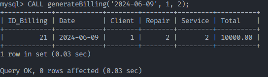
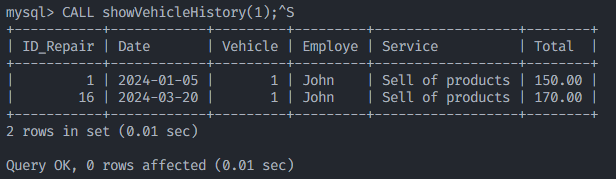
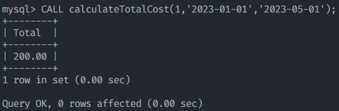
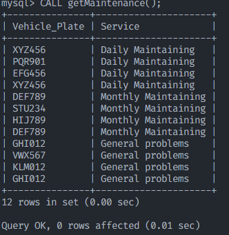
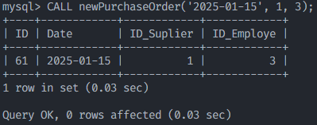
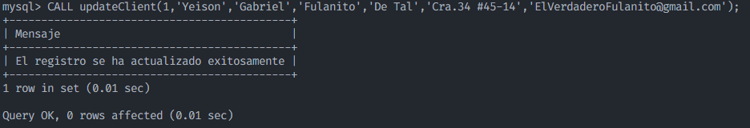
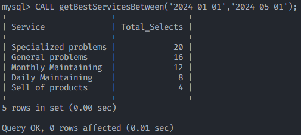

# MySQL_Project

## Consultas Requeridas
### 1. Obtener el historial de reparaciones de un vehículo específico

```sql
SELECT v.IdVehicle AS Cod_Vehicle, v.Plate 
AS Plate, r.Date AS Repair_Date,
e.Name1 AS Employee, s.ServiceName 
AS Service, r.TotalCost, r.
Description
FROM repair r
JOIN vehicle v ON v.IdVehicle = r.FkVehicle
JOIN employe e ON e.IdEmploye = r.FkEmploye
JOIN service s ON s.IdService = r.FkService
WHERE v.IdVehicle = 3;
```

#### Resultado


#### Explicacion

La consulta utiliza las tablas `repair`, 
`vehicle`, `employe` y `service`
para obtener el historial de reparaciones 
de un vehículo específico.
Se utiliza el `JOIN` para relacionar las 
tablas y obtener la información necesaria.
Se utiliza el `WHERE` para filtrar el 
resultado y obtener solo el historial de 
reparaciones del vehículo con el 
`IdVehicle` especificado (en este caso, 3).
El resultado incluye la fecha de 
reparación, el empleado que realizó la 
reparación,
el servicio realizado, el costo total y la 
descripción de la reparación.

### 2. Calcular el costo total de todas las reparaciones realizadas por un empleado específico en un período de tiempo

```sql
SELECT e.IdEmploye AS ID, e.Name1 AS
Employee, SUM(r.TotalCost) AS TotalCost
FROM repair r
JOIN employe e ON e.IdEmploye = r.FkEmploye
WHERE r.Date BETWEEN '2024-01-01' AND 
'2024-02-01'
AND e.IdEmploye = 4
GROUP BY e.Name1;
```

#### Resultado


#### Explicacion

La consulta utiliza las tablas `repair` y 
`employe` para calcular el costo total de
todas las reparaciones realizadas por un 
empleado específico en un período de 
tiempo.
Se utiliza el `JOIN` para relacionar las 
tablas y obtener la información necesaria.
Se utiliza el `WHERE` para filtrar el 
resultado y obtener solo las reparaciones 
realizadas por el empleado con el 
`IdEmploye` especificado (en este caso, 4).
Se utiliza el `BETWEEN` para filtrar el 
período de tiempo en el que se realizar
las reparaciones (en este caso, entre el 1 
de enero de 2024 y el 1 de febrero de 
2024). Se utiliza el `SUM` para calcular 
el costo  total de las reparaciones y el 
`GROUP BY` para agrupar el resultado por 
empleado.

### 3. Listar todos los clientes y los vehículos que poseen

```sql
SELECT c.Name1 AS Customer, v.IdVehicle AS VehicleId, v.Plate AS Plate
FROM client c
JOIN vehicle v ON c.IdClient = v.FkClient
ORDER BY c.Name1
LIMIT 10;
```

#### Resultado


#### Explicacion

La consulta utiliza las tablas `client` y 
`vehicle` para obtener la lista de 
clientes y los vehículos que poseen. Se 
utiliza el `JOIN` para relacionar las 
tablas y
obtener la información necesaria. Se 
utiliza el `ORDER BY` para ordenar el 
resultado por nombre de cliente y el 
`LIMIT` para obtener solo los 10 primeros 
resultados.

### 4. Obtener la cantidad de piezas en inventario para cada pieza

```sql
SELECT p.IdPiece AS Piece_Id, p.PieceName 
AS Piece_Name, SUM(i.Amount) AS Quantity
FROM piece p
JOIN inventory i ON p.IdPiece = i.FkPiece
GROUP BY p.IdPiece, p.PieceName
ORDER BY p.PieceName;
```

#### Resultado


#### Explicacion
La consulta utiliza las tablas `piece` e 
`inventario` para obtener la cantidad de 
piezas en inventario para cada pieza. Se 
utiliza el `JOIN` para relacionar las 
tablas y obtener la informacion 
necesarioa. se utiliza el `GROUP BY` para 
agrupar el resultado por el id de la pieza 
y el nombre de la misma.

### 5. Obtener las citas programadas para un día específico

```sql
SELECT dc.IdDateClient AS ID, dc.Date AS Fecha, c.Name1 AS Cliente
FROM date_client dc
JOIN client c
ON c.IdClient = dc.FkClient
WHERE dc.Date = '2024-01-10';
```

#### Resultado


#### Explicacion
La consulta utiliza las tablas 
`date_client` y `client` para obtener la 
**ID**, **Fecha** de la tabla `date_client` y el nombre del cliente. Utilizamos la clausula `JOIN` para relacionar las tablas correspondientes y obtener la informacion deseada. Por ultimo utilizamos la clausula `WHERE` para especificar la condicion (En este caso los registros que hay para el día 2024-01-10).

### 6. Generar una factura para un cliente específico en una fecha determinada

```sql
SELECT b.IdBilling AS ID, b.Date AS Billing_Date, c.Name1 AS Cliente, b.Total
FROM billing b
JOIN client c
ON c.IdClient = b.FkClient
WHERE c.IdClient = 6 AND b.Date = '2023-06-30';
```

#### Resultado


#### Explicacion
La consulta hace uso de las tablas `billing` y `client` para generar la factura de un cliente especifico en una fecha determinada. Se hace uso de la clausula `JOIN` para relacionar las tablas correspondientes y obtener la informacion deseada.
De la tabla `client` obtenemos el **Nombre**, de la tabla `billing` obtenemos su **ID**, **Fecha** y el **Total**. Hacemos uso de la clausula `WHERE` para especificar la condicion (En este caso el cliente y la fecha especifica de la factura).

### 7. Listar todas las órdenes de compra y sus detalles

```sql
SELECT od.IdOrderDetail AS ID, p.PieceName AS Piece,
od.Amount, od.UnitPrice, od.TotalPrice
FROM order_detail od
JOIN piece p
ON p.IdPiece = od.FkPiece
LIMIT 5;
```

#### Resultado


#### Explicacion
La consulta hace uso de las tablas `piece` y `order_detail`
para listar las ordenes de compra y sus detalles. Hacemos uso de la clausula `JOIN` para relacionar las tablas correspondientes y obtener la informacion deseada.
Obtenemos el nombre de la pieza, el id del pedido, la cantidad, el precio unitario, y el precio total.

### 8. Obtener el costo total de piezas utilizadas en una reparación específica

```sql
SELECT up.FkRepair AS Repair_Code, (up.Amount * p.Price) AS Costo_Total
FROM used_parts up
JOIN piece p
ON p.IdPiece = up.FkPiece
WHERE FkRepair = 6;
```

#### Resultado


#### Explicacion
La consulta hace uso de las tablas `repair` y `piece` para obtener el costo total de piezas utilizadas en una reparacion específica. Se ha ce uso de la clausula `JOIN` para relacionar las tablas correspondientes y obtener el resultado deseado. Por ultimo, hacemos uso de la clausula `WHERE` donde especificamos la condición deseada (En este caso que el id de la reparacion sea igual a 6).

### 9. Obtener el inventario de piezas que necesitan ser reabastecidas (cantidad menor que un umbral)

```sql
SELECT p.PieceName AS Piece, i.Amount AS Piece_Amount, i.AvaliableSpace AS Avaliable_Space
FROM inventory i
JOIN piece p
ON p.IdPiece = i.FkPiece
WHERE i.Amount < i.AvaliableSpace
LIMIT 6;
```

#### Resultado


#### Explicacion
La consulta hace uso de las tablas `piece` e `inventory` para obtener el inventario de piezas que necesitan ser reabastecidas. sSe utiliza la clausula `JOIN` para relacionar las tablas correspondientes. Obtenemos el nombre del producto, su cantidad actual en el stock, y el espacio disponible que poseen (En este caso el espacio disponible es de 70), se excluyen solo los que han llegado al tope. Finalmente limitamos la cantidad de respuestas a solo 6.

### 10. Obtener la lista de servicios más solicitados en un período específico

```sql
SELECT dc.IdDateClient AS ID_Date, dc.FkService AS Service_Code, dc.Date AS Solicited_Date
FROM date_client dc
WHERE dc.Date BETWEEN '2024-01-01' AND '2024-03-01'
LIMIT 5;
```

#### Resultado


#### Explicacion
La consulta hace uso de la tabla `date_client` para obtener la lista de servicios más solicitados en un periodo de tiempo especifico. Utilizamos la clausula `WHERE` para especificar la condicion deseada. Finalmente limitamos la cantidad de resultados a solo 5.

### 11. Obtener el costo total de reparaciones para cada cliente en un período específico

```sql
SELECT c.Name1 AS Customer, SUM(b.Total) AS Total_Cost
FROM billing b
JOIN client c
ON c.IdClient = b.FkClient
WHERE b.Date BETWEEN '2023-01-01' AND '2023-06-03'
GROUP BY Customer;
```

#### Resultado


#### Explicacion 
La consulta hace uso de las tablas `client` y `billing` para obtener el costo total de reparaciones para cada cliente en un periodo específico. Utilizamos la clausula `JOIN` para relacionar las tablas correspondientes y obtener el resultado deseado, por otra parte, se usa la clausula `WHERE` para especificar la condicion deseada. Por ultimo, hacemos uso de la clausula `GROUP BY` para agrupar los resultados por el nombre del cliente.

### 12. Listar los empleados con mayor cantidad de reparaciones realizadas en un período específico

```sql
SELECT COUNT(r.IdRepair) AS Total_Repairs, e.Name1 AS Employee
FROM repair r
JOIN employe e
ON e.IdEmploye = r.FkEmploye
WHERE r.Date BETWEEN '2024-01-01' AND '2024-04-01'
GROUP BY Employee;
```

#### Resultado


#### Explicacion 
La consulta hace uso de las tablas `repair` y `employe` para listar los empleados con mayor cantidad de reparaciones realizadas en un período específico. Utilizamos la claus

### 13. Obtener las piezas más utilizadas en reparaciones durante un período específico

```sql
SELECT p.PieceName AS Piece, COUNT(up.FkRepair) AS Repairs
FROM used_parts up
JOIN piece p
ON p.IdPiece = up.FkPiece
JOIN repair r
ON r.Idrepair = up.FkRepair
WHERE r.Date BETWEEN '2024-01-01' AND '2024-04-01'
GROUP BY Piece
LIMIT 5;
```

#### Resultado


#### Explicacion (pendiente)

### 14. Calcular el promedio de costo de reparaciones por vehículo

```sql
DESCRIBE repair;
SELECT AVG(r.TotalCost) AS Cost_Average
FROM repair r;
```

#### Resultado


### 15. Obtener el inventario de piezas por proveedor

```sql
SELECT s.SuplierName AS Suplier ,p.PieceName AS Piece
FROM piece p
JOIN suplier s
ON s.IdSuplier = p.FkSuplier
LIMIT 8;
```


#### 16. Listar los clientes que no han realizado reparaciones en el último año

```sql
SELECT c.Name1 AS Customer, b.Date
FROM billing b
RIGHT JOIN client c
ON c.IdClient = b.FkClient
WHERE b.FkClient IS NULL
LIMIT 9;
```

#### Resultado


#### Explicacion

### 17. Obtener las ganancias totales del taller en un período específico

```sql
SELECT SUM(b.Total) AS Total_Profits
FROM billing b;
```

#### Resultado 


#### Explicacion (pediente)

### 18. Listar los empleados y el total de horas trabajadas en reparaciones en un período específico (asumiendo que se registra la duración de cada reparación)

```sql
SELECT e.Name1 AS Employe, SUM(r.WorkedHours) AS Worked_Hours
FROM repair r
JOIN employe e
ON e.IdEmploye = r.FkEmploye
WHERE r.Date BETWEEN '2024-01-01' AND '2024-05-01'
GROUP BY Employe;
```

#### Resultado


#### Explicacion (pendiente)

### 19. Obtener el listado de servicios prestados por cada empleado en un período específico

```sql
SELECT s.ServiceName AS Service, e.Name1 AS Employe
FROM repair r
JOIN employe e
ON e.IdEmploye = r.FkEmploye
JOIN service s
ON s.IdService = r.FkService
WHERE r.Date BETWEEN '2024-01-01' AND '2024-05-01';
```

#### Resultado 


#### Explicacion (pendiente)

## Subconsultas

### 1. Obtener el cliente que ha gastado más en reparaciones durante el último año.

```sql
SELECT c.Name1 AS Customer, SUM(b.Total) AS Total_Paid, b.Date
FROM billing b
JOIN client c
ON c.IdClient = b.FkClient
WHERE b.Total = (SELECT MAX(b2.Total) FROM billing b2) AND YEAR(b.Date) = '2023'
GROUP BY Customer, b.Date;
```

#### Resultado 


#### Explicacion
La consulta utiliza las tablas `client` y `billing` para obtener el cliente que ha gastado más en reparaciones durante el ultimo año. Se utiliza la clausula `JOIN` para relacionar las tablas correspondientes y obtener el resultado deseado, además, se usa el `WHERE` para especificar la condicion deseada, Dentro de este se hace uso de una **Subconsulta** para obtener el maximo pagado por un cliente. Finalmente se hace uso de la clausula `YEAR()` para especificar que el año sea el ultimo año registrado.

### 3. Obtener los proveedores que suministran las piezas más caras

```sql
SELECT p.PieceName AS Piece, (SELECT s.SuplierName FROM suplier s WHERE s.IdSuplier = p.FkSuplier) AS Suplier, p.Price
FROM piece p
ORDER BY p.Price DESC
LIMIT 6;
```

#### Resultado


#### Explicacion (Pendiente)

### 4. Listar las reparaciones que no utilizaron piezas específicas durante el último año

```sql
SELECT r.IdRepair
FROM repair r
WHERE r.Date BETWEEN '2023-06-01' AND '2024-06-01'
AND r.IdRepair NOT IN (
    SELECT up.FkRepair
    FROM used_parts up
    WHERE up.FkPiece = 3
)
LIMIT 6;
```

#### Resultado 


#### Explicacion

### 5. Obtener las piezas que están en inventario por debajo del 10% del stock inicial

```sql
SELECT (
    SELECT p.PieceName
    FROM piece p
    WHERE p.IdPiece = i.FkPiece
) AS Piece
FROM inventory i
WHERE i.Amount < (
    SELECT 0.1 * i.AvaliableSpace
    FROM inventory ii
    WHERE ii.FkPiece = i.FkPiece
    LIMIT 1
);
```

#### Resultado


## Procedimientos Almacenados
 
### 1. Crear un procedimiento almacenado para insertar una nueva reparación.

```sql
DELIMITER $$
DROP PROCEDURE IF EXISTS insertRepair $$
CREATE PROCEDURE insertRepair (
    IN inDate DATE,
    IN FkVehicle INT,
    IN FkEmploye INT,
    IN FkService INT,
    IN Description MEDIUMTEXT,
    IN WorkedHours INT
)
BEGIN 
    INSERT INTO repair (Date, FkVehicle, FkEmploye, FkService, TotalCost, Description, WorkedHours)
    VALUES (
        inDate,
        FkVehicle,
        FkEmploye,
        FkService,
        (SELECT s.Cost * WorkedHours FROM service s WHERE s.IdService = FkService),
        Description,
        WorkedHours
    );
END $$
DELIMITER ;
```

#### Resultado


### 2. Crear un procedimiento almacenado para actualizar el inventario de una pieza.

```sql
DELIMITER $$

DROP PROCEDURE IF EXISTS updatePieceInventory $$

CREATE PROCEDURE updatePieceInventory(
    IN idInventory INT,
    IN Amount INT,
    IN NewAvaliableSpace INT
)
BEGIN
    UPDATE inventory i
    SET
        i.Amount = Amount,
        i.AvaliableSpace = NewAvaliableSpace
    WHERE
        i.IdInventory = idInventory;
END $$

DELIMITER ;

```

#### Resultado


### 3. Crear un procedimiento almacenado para eliminar una cita

```sql
DELIMITER $$

DROP PROCEDURE IF EXISTS deleteClientDate $$

CREATE PROCEDURE deleteClientDate(

    IN id INT

)
BEGIN

    DELETE FROM date_client WHERE IdDateClient = id;

END $$

DELIMITER ;
```

#### Resultado


### 4. Crear un procedimiento almacenado para generar una factura

```sql
DELIMITER $$

DROP PROCEDURE IF EXISTS generateBilling $$

CREATE PROCEDURE generateBilling(
    IN date DATE,
    IN IdClient INT,
    IN IdRepair INT
)
BEGIN
    -- Insert the data
    INSERT INTO billing(Date, FkClient, FkRepair, FkService, Total)
    VALUES (
        date,
        IdClient,
        IdRepair,
        (
            SELECT r.FkService
            FROM repair r
            WHERE r.IdRepair = IdRepair
            LIMIT 1
        ),
        (
            SELECT (s.Cost * r.WorkedHours)
            FROM repair r
            JOIN service s ON s.IdService = r.FkService
            WHERE r.IdRepair = IdRepair
            LIMIT 1
        )
    );

    -- Select the data
    SELECT 
        b.IdBilling AS ID_Billing,
        b.Date,
        b.FkClient AS Client,
        b.FkRepair AS Repair,
        b.FkService AS Service,
        b.Total
    FROM billing b
    ORDER BY b.IdBilling DESC
    LIMIT 1;
END $$

DELIMITER ;
```

#### Resultado



### 5. Crear un procedimiento almacenado para obtener el historial de reparaciones de un vehículo

```sql
DELIMITER $$

DROP PROCEDURE IF EXISTS showVehicleHistory $$

CREATE PROCEDURE showVehicleHistory(
    IN IdVehicle INT
)
BEGIN
    -- Query to show the vehicle history
    SELECT r.IdRepair AS ID_Repair,
           r.Date,
           r.FkVehicle AS Vehicle,
           e.Name1 AS Employe,
           s.ServiceName AS Service,
           r.TotalCost AS Total
    FROM repair AS r
    JOIN employe AS e
    ON e.IdEmploye = r.FkEmploye
    JOIN service AS s
    ON s.IdService = r.FkService
    WHERE r.FkVehicle = IdVehicle;
END $$

DELIMITER ;
```

#### Resultado 



### 6. Crear un procedimiento almacenado para calcular el costo total de reparaciones de un cliente en un período

```sql
DELIMITER $$

DROP PROCEDURE IF EXISTS calculateTotalCost $$

CREATE PROCEDURE calculateTotalCost (
    IN IdClient INT,
    IN Date1 DATE,
    IN Date2 DATE
)
BEGIN
    SELECT SUM(b.Total) AS Total
    FROM billing AS b
    WHERE b.FkClient = IdClient AND (
        b.Date BETWEEN Date1 AND Date2
    );
END $$

DELIMITER ;
```

#### Resultado



### 7. Crear un procedimiento almacenado para obtener la lista de vehículos que requieren mantenimiento basado en el kilometraje.

```sql
DELIMITER $$

DROP PROCEDURE getMaintenance $$

CREATE PROCEDURE getMaintenance ()
BEGIN
    -- query to get the wishes results
    SELECT v.Plate AS Vehicle_Plate,
           s.ServiceName AS Service
    FROM repair AS r
    JOIN vehicle AS v
    ON v.IdVehicle = r.FkVehicle
    JOIN service AS s
    ON s.IdService = r.FkService
    WHERE (r.FkService = 4)OR
          (r.FkService = 2)OR
          (r.FkService = 3);
END $$

DELIMITER ;
```

#### Resultado



### 8. Crear un procedimiento almacenado para insertar una nueva orden de compra

```sql
DELIMITER $$

DROP PROCEDURE IF EXISTS newPurchaseOrder $$

CREATE PROCEDURE newPurchaseOrder(
    IN Date DATE,
    IN IdSuplier INT,
    IN IdEmploye INT
)
BEGIN
    -- Insert the data
    INSERT INTO purchase_order(
        IdPurchaseOrder,
        OrderDate,
        FkSuplier,
        FkEmploye
    )
    VALUES
    (
        NULL,
        Date,
        IdSuplier,
        IdEmploye
    );

    -- Select the data insert
    SELECT po.IdPurchaseOrder AS ID,
           po.OrderDate AS Date,
           po.FkSuplier AS ID_Suplier,
           po.FkEmploye AS ID_Employe
    FROM purchase_order AS po
    ORDER BY IdPurchaseOrder DESC
    LIMIT 1;
END $$

DELIMITER ;
```
#### Resultado



### 9. Crear un procedimiento almacenado para actualizar los datos de un cliente

```sql
DELIMITER $$

DROP PROCEDURE IF EXISTS updateClient $$

CREATE PROCEDURE updateClient(
    IN ID INT,
    IN NewName1 VARCHAR(85),
    IN NewName2 VARCHAR(85),
    IN NewLastName1 VARCHAR(36),
    IN NewLastName2 VARCHAR(36),
    IN NewAddress VARCHAR(100),
    IN NewEmail VARCHAR(100)
)
BEGIN
    -- declare variable message
    DECLARE message VARCHAR(100);

    -- update the client data
    UPDATE client AS c
    SET c.Name1 = NewName1,
        c.Name2 = NewName2,
        c.LastName1 = NewLastName1,
        c.LastName2 = NewLastName2,
        c.Address = NewAddress,
        c.Email = NewEmail
    WHERE
        c.IdClient = ID;
    
    IF ROW_COUNT() > 0 THEN
		SET message = 'El registro se ha actualizado exitosamente';
	ELSE
		SET message = 'Error al actualizar el registro';
	END IF;
	
	SELECT message AS 'Mensaje';

END $$

DELIMITER ;
```

#### Resultado



### 10. Crear un procedimiento almacenado para obtener los servicios más solicitados en un período

```sql
DELIMITER $$

DROP PROCEDURE IF EXISTS getBestServicesBetween $$

CREATE PROCEDURE getBestServicesBetween(
    IN Date1 DATE,
    IN Date2 DATE
)
BEGIN
    -- query to select the best services selected between a date
    SELECT s.ServiceName AS Service, SUM(r.FkService) AS Total_Selects
    FROM repair AS r
    JOIN service AS s
    ON s.IdService = r.FkService
    WHERE r.Date BETWEEN Date1 AND Date2
    GROUP BY s.ServiceName
    ORDER BY Total_Selects DESC;
END $$

DELIMITER ;
```

#### Resultado


